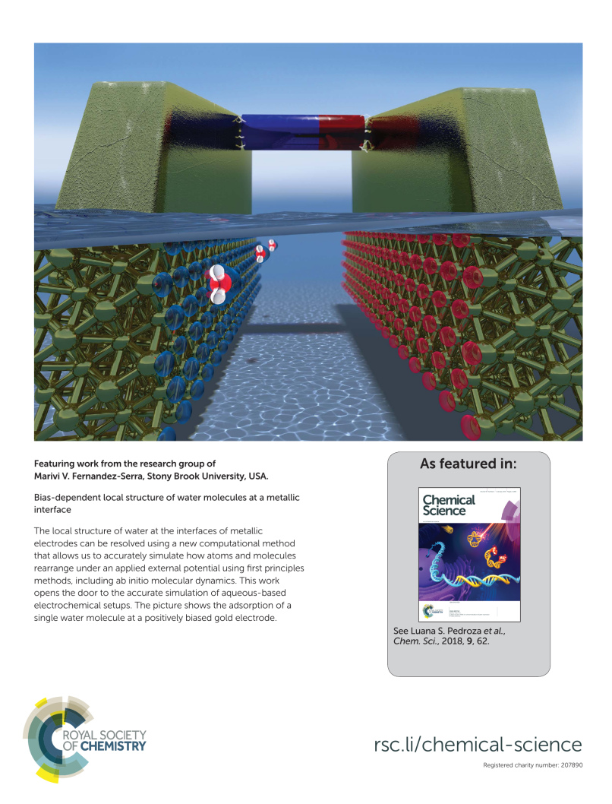

##### Abstract

Understanding the local structure of water at the interfaces of metallic electrodes is a key issue in aqueous-based electrochemistry.
Nevertheless a realistic simulation of such a setup is challenging, particularly when the electrodes are maintained at different potentials.
To correctly compute the effect of an external bias potential applied to truly semi-infinite surfaces, we combine Density Functional Theory (DFT) and Non-Equilibrium Green's Function (NEGF) methods.
This framework allows for the out-of-equilibrium calculation of forces and dynamics, and directly correlates to the chemical potential of the electrodes, which is introduced experimentally.
In this work, we apply this methodology to study the electronic properties and atomic forces of a water molecule at the interface of a gold surface.
We find that the water molecule tends to align its dipole moment with the electric field, and it is either repelled or attracted to the metal depending on the sign and magnitude of the applied bias, in an asymmetric fashion.

##### Press release <a target="_blank" href="https://twitter.com/CFMdonostia/status/959321271526805504"><span class="icon fa-twitter fa-lg style1"></span></a>

Our article was highlighted and discussed at [*Mapping Ignorance*](https://mappingignorance.org/2018/02/01/accurate-simulation-aqueous-based-electrochemical-setups/).

The following image (made by me with [Blender](https://www.blender.org/)) was selected as the **outside back cover** for Issue 1 of Chemical Science 2018:

<div class="box alt">
  <div class="row uniform 50%">
    <div class="12u">
      <span class="image fitred">
        
      </span>
    </div>
  </div>
</div>

##### Bibtex citation

```
@Article{Pedroza2018,
  author    = {Luana S. Pedroza and Pedro Brandimarte and Alexandre Reily Rocha and M.-V. Fern{\'{a}}ndez-Serra},
  title     = {Bias-dependent local structure of water molecules at a metallic interface},
  journal   = {Chemical Science},
  year      = {2018},
  volume    = {9},
  number    = {1},
  pages     = {62--69},
  issn      = {2041-6520},
  doi       = {10.1039/c7sc02208e},
  publisher = {Royal Society of Chemistry ({RSC})},
}
```
